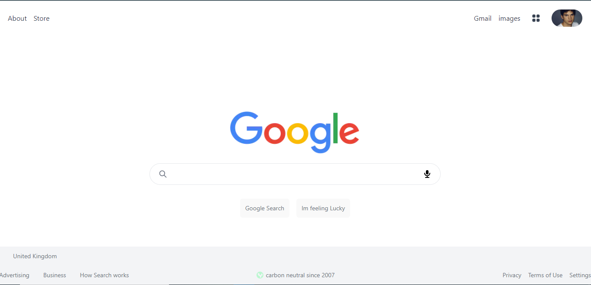
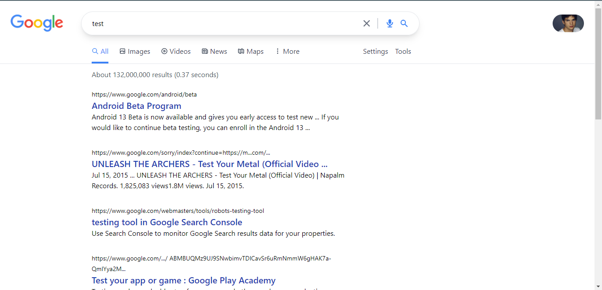

# Google-clone-App
This is a [Next.js](https://nextjs.org/) project bootstrapped with [`create-next-app`](https://github.com/vercel/next.js/tree/canary/packages/create-next-app).

## Table of contents

- [Overview](#overview)
  - [The challenge](#the-challenge)
  - [Screenshot](#screenshot)
  - [Links](#links)
- [My process](#my-process)
  - [Built with](#built-with)
  - [What I learned](#what-i-learned)
  - [Useful resources](#useful-resources

## Overview

### The challenge

Users should be able to:

- View the optimal layout for the site depending on their device's screen size
- Search
- view results
- Navigate to another page

### Screenshot




### Links

- Solution URL: (https://github.com/faozziyyah/google-clone)
- Live Site URL: (https://google-clone-faozziyyah.vercel.app/)

## My process

### Built with

- CSS
- [Tailwind](https://tailwindcss.com/) - Tailwind: CSS framework
- [React](https://reactjs.org/) - React: JS library
- [Material Ui Icons](https://mui.com/) - Material Ui Icons

### What I learned

- How to use material UI Icons in NextJs
- Tailwind CSS

```Next.js
const router = useRouter();
  const searchInputRef = useRef(null);

  const search = e => {
    e.preventDefault();

    const term = searchInputRef.current.value;

    if (!term) return;

    router.push(`/search?term=${term}`);
```
```Next.js
<input 
    ref={searchInputRef} 
    className="flex-grow w-full focus:outline-none" 
    type="text" 
    defaultValue={router.query.term} 
/>
            
<XIcon  
  className="h-7 text-gray-500 cursor-pointer transition duration-100 transform hover:scale125 sm:mr-3"
  onClick={() =>  {searchInputRef.current.value = ""}}
/>
```

### Useful resources
## Getting Started

First, run the development server:

```bash
npm run dev
# or
yarn dev
```

Open [http://localhost:3000](http://localhost:3000) with your browser to see the result.

You can start editing the page by modifying `pages/index.js`. The page auto-updates as you edit the file.

[API routes](https://nextjs.org/docs/api-routes/introduction) can be accessed on [http://localhost:3000/api/hello](http://localhost:3000/api/hello). This endpoint can be edited in `pages/api/hello.js`.

The `pages/api` directory is mapped to `/api/*`. Files in this directory are treated as [API routes](https://nextjs.org/docs/api-routes/introduction) instead of React pages.

## Learn More

To learn more about Next.js, take a look at the following resources:

- [Next.js Documentation](https://nextjs.org/docs) - learn about Next.js features and API.
- [Learn Next.js](https://nextjs.org/learn) - an interactive Next.js tutorial.

You can check out [the Next.js GitHub repository](https://github.com/vercel/next.js/) - your feedback and contributions are welcome!

## Deploy on Vercel

The easiest way to deploy your Next.js app is to use the [Vercel Platform](https://vercel.com/new?utm_medium=default-template&filter=next.js&utm_source=create-next-app&utm_campaign=create-next-app-readme) from the creators of Next.js.

Check out our [Next.js deployment documentation](https://nextjs.org/docs/deployment) for more details.
